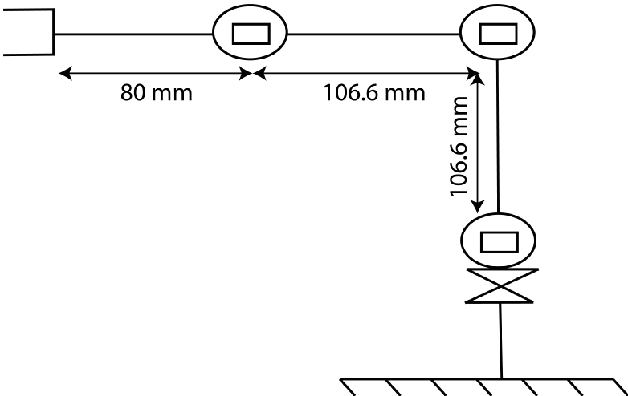
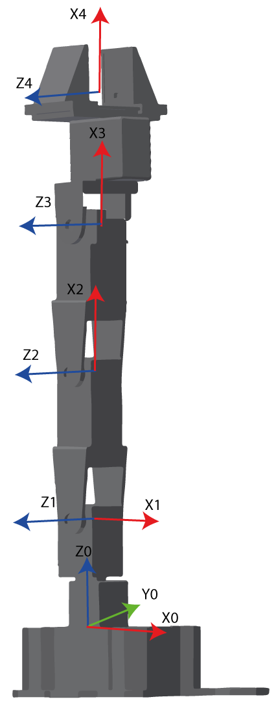
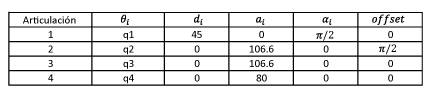
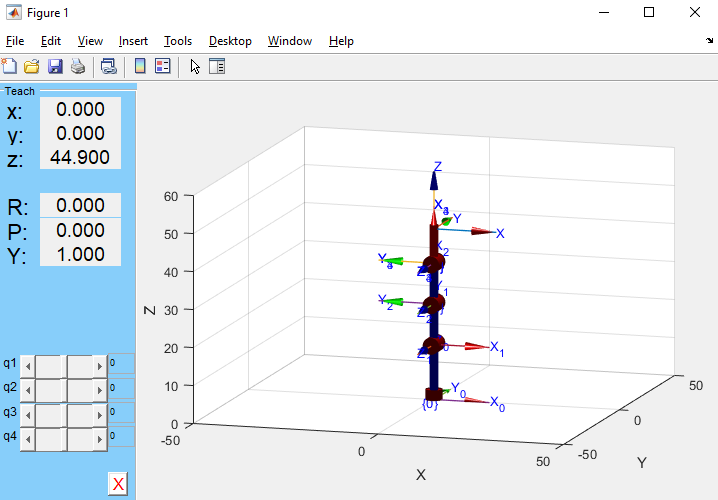

# robotica-lab2
## 1. Diagrama del robot Phantom X y sus parámetros DH
A continuación podemos observar el diagrama del Phantom X donde podemos observar las medidas, se tuvo en cuenta además una distancia de 45mm entre la primera y segunda articulación (De abajo hacia arrabo)

A continuación podemos observar los marcos coordenados para los parametros de Denavit-Hartenber.

Donde se obtienen la siguiente tabla con los parametros de Denavit-Hartenvber.

## 2. Conexión con ROS
### Procedimiento
1. Se realizó el script *mov_px.py* ubicado en *px_robot/scripts/* permite mover las juntas del robot de la siguiente forma:
- La tecla 'w' permite seleccionar la siguiente junta: si se está en la junta 1 (waist) se pasa a la junta 2 (elbow).
- La tecla 's' permite seleccionar la junta anterior.
- La tecla 'a' lleva la junta seleccionada a su posición de home.
- La tecla 'd' lleva la junta seleccionada a una posición deseada (ingresada por consola), la cual está en enteros donde 0 es el valor mínimo y 1023 la posición máxima del motor.

2. Para lograr la lectura de las teclas se crea la función getKey() tomada de [5].
3. Se creó la función `actions()` la cual decide la acción a realizar según la tecla oprimida.
4. Para el movimiento de las juntas se importó la función `jointCommand()` del script *jointSrv.py* el cual permite llamar al servicio *dynamixel_command*. De esta forma se puede usar `jointCommand()` para
###Análisis
## 3. Uso del TCP
### Procedimiento
### Análisis

## 4. MATLAB + ROS + TCP

Para simular el robot Phantom X por medio del toolbox de peter corke se utilizaron las siguientes funciones:

Link: La cual crea un objeto de tipo Link que guarda toda la información relacionada a la articulación de un robot: así que se crearon los 4 eslabones insertando los parametros de Denavit-Hartenber de la siguiente manera:

`L1 = 45 ;L2 = 106.6; L3 = L2; L4 = 80;` 

`L(1) = Link('revolute', 'd', L1, 'a', 0, 'alpha', pi/2, 'offset', 0);`  

`L(2) = Link('revolute', 'd', 0, 'a', L2, 'alpha', 0, 'offset', pi/2);`  

`L(3) = Link('revolute', 'd', 0, 'a', L3, 'alpha', 0, 'offset', 0);`  

`L(4) = Link('revolute', 'd', 0, 'a', L4, 'alpha', 0, 'offset', 0);`  

Luego se procede a unir los links por medio de la funcion "SerialLink", de la siguiente manera:

Phantom = SerialLink(L,'name', 'Phantom X')

El cual arrojo la siguiente tabla que muestra los parametros de Denavit-Hartenber,

 además se utilizó el metodo .plot(q) en el objeto SerialLink obtenido, la cual tiene como argumento el vector de los valores de q para cada articulación y tiene como salida el gráfico del robot con dichos valores de q, obteniendo entonces:
 
 
 

Video demostrativo: https://youtu.be/5YeRemsvWN0
### Procedimiento
### Análisis
## Conclusiones
## Referencias
[5] [Python for fun: Get Key Pressed in Python](http://python4fun.blogspot.com/2008/06/get-key-press-in-python.html)
